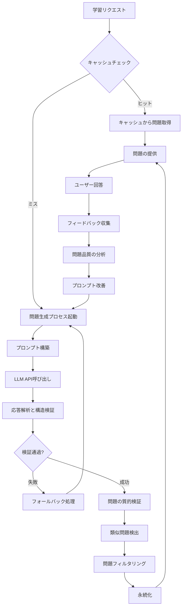
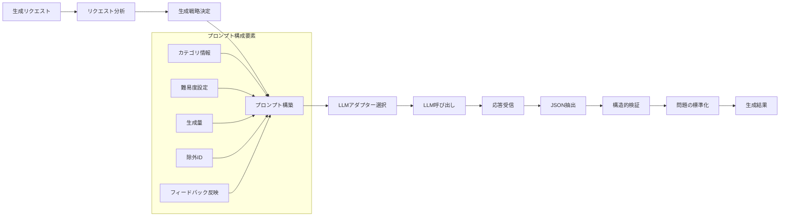
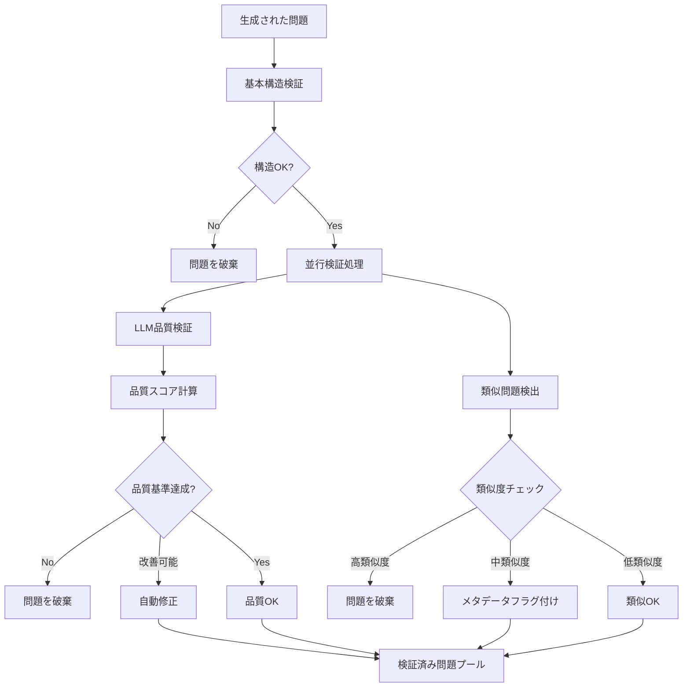
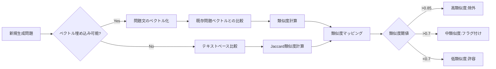
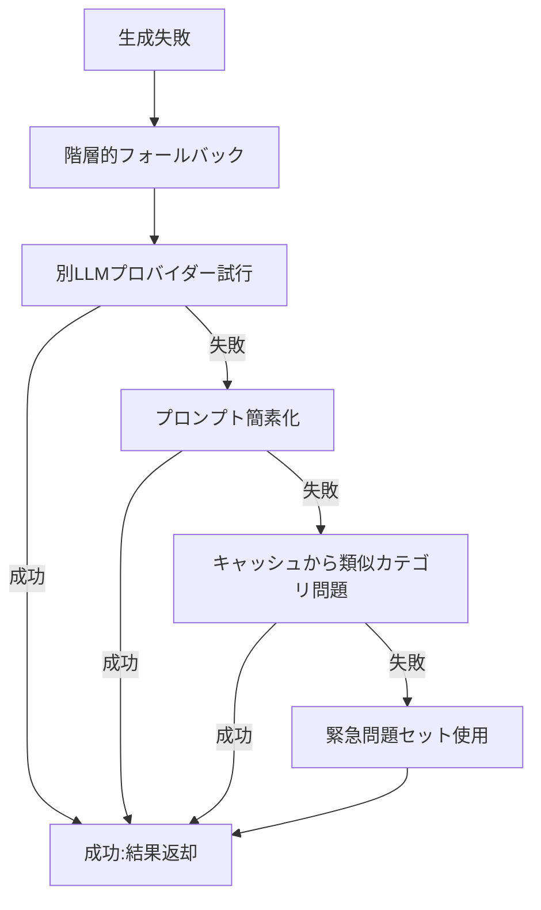

# Lernix: 問題生成・提供フロー設計

## 概要

Lernixはターミナルベースの学習システムで、LLMを活用して様々なカテゴリの問題を生成します。本ドキュメントでは問題の生成から提供までのフローを定義します。

## エンドツーエンドフロー

## 1. 問題生成フロー

## 2. 問題検証フロー

## 3. 類似問題検出フロー

## 4. フォールバックメカニズム

## 実装優先度

1. **P0 (必須)**
   - 基本的な問題生成と構造検証
   - 単純なJSONパースとエラーハンドリング
   - 最小限のフォールバック機能

2. **P1 (重要)**
   - 問題キャッシュ管理
   - 基本的な品質チェック
   - シンプルな類似度検証

3. **P2 (付加価値)**
   - LLMによる高度な品質検証
   - 学習履歴を考慮した問題選択
   - ベクトル埋め込みによる類似度検出

4. **P3 (最適化)**
   - 非同期バッチ生成
   - 高度なプロンプト最適化
   - ユーザー特性に基づく適応

## 実装上の考慮点

- **モジュラー設計**: 各検証ステップは独立して実装・拡張可能
- **段階的実装**: 基本機能から始め、徐々に高度な機能を追加
- **コスト効率**: LLM呼び出しはバッチ処理と必要に応じた検証で最適化
- **ユーザー体験**: ユーザー待機時間を最小化するための非同期処理

Lernixの問題生成フローは知識提供の核心部分であり、このフローの質がアプリケーション全体の価値を決定します。基本的な生成と検証から始め、ユーザーフィードバックに基づいて継続的に改良していくことが重要です。
