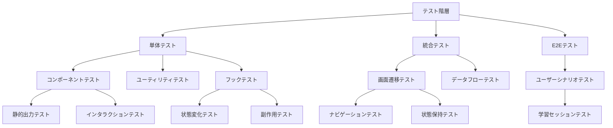
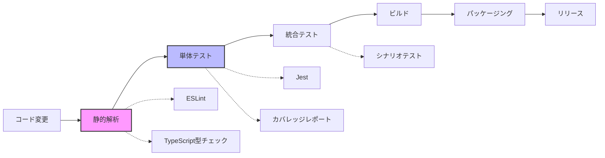

# React Ink TUIアプリケーションのベストプラクティスとテスト戦略

## 現状分析と課題

Lernixプロジェクトでは、TypeScript + React Inkを用いたTUIアプリケーションの実装を行っています。現在の実装では以下の課題が見受けられます：

1. **モジュールシステムの設定**
   - ESMモジュールの一貫性確保
   - インポートパス拡張子の適切な管理

2. **型安全性の確保**
   - 開発効率と型安全性のバランス
   - 適切な型定義の維持

3. **テスト基盤の欠如**
   - TUIアプリケーションの自動テスト方法
   - インタラクティブ要素の検証方法

## 改善計画

### 1. モダンなTypeScript + ESM設定

現在の`tsconfig.json`は適切に構成されていますが、さらに最新のプラクティスに合わせて以下の設定を推奨します：

```json
{
  "compilerOptions": {
    "target": "ES2022",
    "module": "NodeNext",
    "moduleResolution": "NodeNext",
    "jsx": "react",
    "esModuleInterop": true,
    "outDir": "dist",
    "rootDir": "src",
    "strict": true,
    "declaration": true,
    "forceConsistentCasingInFileNames": true,

    // 追加推奨設定
    "isolatedModules": true,
    "noUncheckedIndexedAccess": true,
    "exactOptionalPropertyTypes": true
  }
}
```

これらの設定は以下の利点を提供します：
- `isolatedModules`: トランスパイラ互換性の向上
- `noUncheckedIndexedAccess`: オブジェクトインデックスアクセス時の型安全性強化
- `exactOptionalPropertyTypes`: オプションプロパティの厳密な型チェック

### 2. 自動テスト戦略

TUIアプリケーションのテストは一般的なWebアプリケーションとは異なるアプローチが必要です。ink-testing-libraryを活用した包括的なテスト戦略を構築します。

#### テスト環境のセットアップ

```bash
npm install --save-dev jest @types/jest ts-jest ink-testing-library
```

**jest.config.js**
```javascript
module.exports = {
  preset: 'ts-jest',
  testEnvironment: 'node',
  moduleNameMapper: {
    '^@/(.*)$': '<rootDir>/src/$1'
  },
  testMatch: ['**/__tests__/**/*.test.ts?(x)'],
  transform: {
    '^.+\\.(ts|tsx)$': ['ts-jest', {
      tsconfig: 'tsconfig.test.json'
    }]
  }
};
```

**tsconfig.test.json** (テスト専用設定)
```json
{
  "extends": "./tsconfig.json",
  "compilerOptions": {
    "jsx": "react-jsx",
    "types": ["jest", "node"]
  }
}
```

#### コンポーネントテストの例

```typescript
// __tests__/components/Header.test.tsx
import React from 'react';
import { render } from 'ink-testing-library';
import { Header } from '../../src/components/Header';

describe('Header Component', () => {
  test('タイトルが正しく表示される', () => {
    const { lastFrame } = render(<Header title="Lernix学習システム" />);
    expect(lastFrame()).toContain('Lernix学習システム');
  });

  test('スタイリングが適用されている', () => {
    const { lastFrame } = render(<Header title="スタイルテスト" />);
    // ボーダーやカラーなどの表現を検証
    expect(lastFrame()).toMatch(/[═]/); // ボーダー文字の確認
  });
});
```

#### インタラクションテスト

```typescript
// __tests__/components/CategorySelector.test.tsx
import React from 'react';
import { render } from 'ink-testing-library';
import { CategorySelector } from '../../src/components/CategorySelector';

describe('CategorySelector Component', () => {
  const categories = [
    { id: '1', name: 'JavaScript', description: 'JS基礎' },
    { id: '2', name: 'TypeScript', description: '型システム' }
  ];

  test('カテゴリリストが表示される', () => {
    const { lastFrame } = render(
      <CategorySelector
        categories={categories}
        onSelect={() => {}}
      />
    );

    expect(lastFrame()).toContain('JavaScript');
    expect(lastFrame()).toContain('TypeScript');
  });

  test('矢印キーでの選択が機能する', () => {
    const onSelect = jest.fn();
    const { stdin, lastFrame } = render(
      <CategorySelector
        categories={categories}
        onSelect={onSelect}
      />
    );

    // 下矢印キーを送信して2番目のアイテムを選択
    stdin.write('\x1B[B'); // 下矢印キー

    // Enterキーを送信して選択を確定
    stdin.write('\r');

    expect(onSelect).toHaveBeenCalledWith(categories[1]);
  });
});
```

#### スナップショットテスト

```typescript
// __tests__/screens/HomeScreen.test.tsx
import React from 'react';
import { render } from 'ink-testing-library';
import { HomeScreen } from '../../src/screens/HomeScreen';

describe('HomeScreen', () => {
  test('ホーム画面のレイアウトがスナップショットと一致する', () => {
    const { lastFrame } = render(<HomeScreen />);
    expect(lastFrame()).toMatchSnapshot();
  });
});
```

#### テストカバレッジ目標

| カテゴリ | カバレッジ目標 | 優先度 |
|----------|--------------|-------|
| コンポーネント | 90% | 高 |
| 画面 | 80% | 中 |
| 状態管理 | 85% | 高 |
| ユーティリティ | 95% | 中 |

### 3. テスト自動化パイプライン

CI/CD環境でのテスト自動化を実装します：

```yaml
# .github/workflows/test.yml
name: Test

on:
  push:
    branches: [ main, develop ]
  pull_request:
    branches: [ main, develop ]

jobs:
  test:
    runs-on: ubuntu-latest
    steps:
      - uses: actions/checkout@v3
      - uses: actions/setup-node@v3
        with:
          node-version: '18'
          cache: 'npm'
      - run: npm ci
      - run: npm test
      - name: Upload coverage
        uses: codecov/codecov-action@v3
```

## テスト階層構造



## CI/CDパイプライン設計



## おわりに

この計画を実装することで、Lernixプロジェクトは以下の利点を得られます：

1. **高い型安全性**: モダンなTypeScript設定による堅牢なコードベース
2. **テスト可能なアーキテクチャ**: TUIコンポーネントの自動テスト基盤
3. **継続的品質保証**: CI/CDによる自動テストと品質チェック

TUI（ターミナルUI）アプリケーションは視覚的なフィードバックが限られるため、自動テストの重要性がより高くなります。ink-testing-libraryを活用し、ユーザー体験を損なうことなく品質を担保できる体制を構築しましょう。